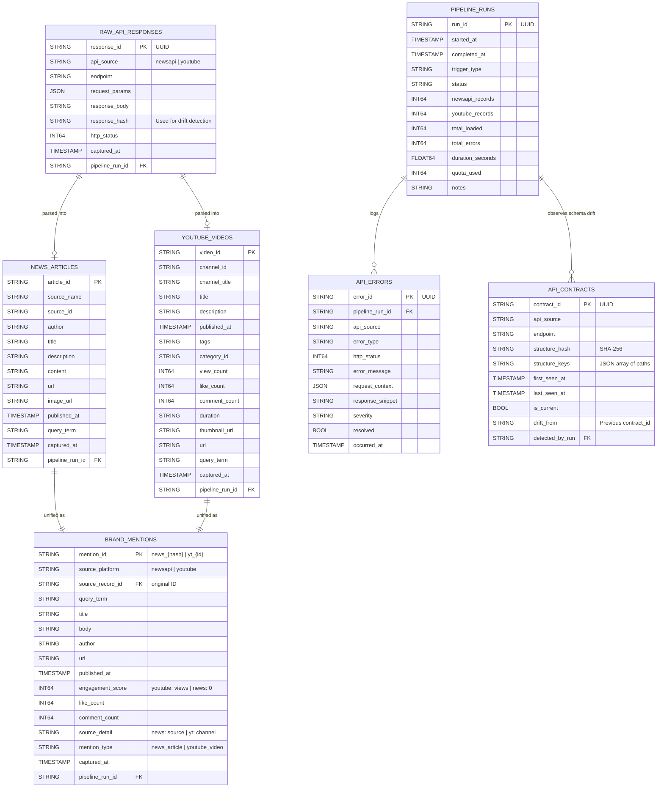

# TwoLens

**Brand intelligence pipeline: comparing what the media says vs. what creators and consumers say.**

TwoLens pulls data from two sources on a twice-daily schedule, transforms unstructured API responses into structured BigQuery tables, and merges everything into a single `brand_mentions` table you can query across both sources. It monitors itself for API failures, schema changes, and quota usage, alerting on Slack when something needs attention.

---

## How It Works

The pipeline runs twice daily via GitHub Actions and follows a raw → structured → unified model:

```
                    ┌──────────────┐
                    │  Scheduled   │
                    │  Trigger     │
                    │  (2x daily)  │
                    └──────┬───────┘
                           │
                    ┌──────▼───────┐
                    │  Preflight   │
                    │  Checks      │  ← Validates API keys, BQ access, Slack
                    └──────┬───────┘
                           │
              ┌────────────┴────────────┐
              │                         │
     ┌────────▼─────────┐     ┌─────────▼────────┐
     │  Lens 1: NewsAPI │     │  Lens 2: YouTube │
     │  /v2/everything  │     │  search + videos │
     └────────┬─────────┘     └─────────┬────────┘
              │                         │
              │   For each query term:  │
              │   1. Fetch from API     │
              │   2. Store raw response │
              │   3. Check for drift    │
              │   4. Validate (Pydantic)│
              │   5. Transform          │
              │   6. Load to BigQuery   │
              │                         │
              └────────────┬────────────┘
                           │
              ┌────────────▼────────────┐
              │      BigQuery           │
              │                         │
              │  raw_api_responses      │  ← Full JSON payloads
              │  news_articles          │  ← Structured per-source
              │  youtube_videos         │  ← Structured per-source
              │  brand_mentions         │  ← Unified query surface
              │  pipeline_runs          │  ← Run lifecycle
              │  api_errors             │  ← Granular error tracking
              │  api_contracts          │  ← Schema drift history
              └────────────┬────────────┘
                           │
              ┌────────────▼────────────┐
              │  Slack Notifications    │
              │                         │
              │  • Pipeline summary     │
              │  • Fatal errors         │
              │  • Schema drift alerts  │
              │  • Quota warnings       │
              └─────────────────────────┘
```

## Data Sources

### Lens 1: NewsAPI (Media Coverage)

What editors and journalists are publishing about a brand. Uses the `/v2/everything` endpoint with quoted exact-match queries.

**Free tier limits:** 100 requests/day, articles delayed 24 hours, content truncated to ~200 characters. At 3 query terms per run × 2 runs/day = 6 requests/day (6% of daily limit).

### Lens 2: YouTube Data API v3 (Creator & Consumer Voice)

What YouTubers, reviewers, and commentators are saying. Uses a two-step fetch: `search.list` finds videos matching the query (100 units each), then `videos.list` gets full statistics, tags, and descriptions (1 unit per batch).

**Free tier limits:** 10,000 units/day. At 3 terms × 2 runs/day × (100 + 1) units per term = ~606 units/day (6% of daily limit).

### Why These Two

NewsAPI gives the institutional media perspective: what outlets like TechCrunch, BBC, and Bloomberg are reporting. YouTube gives the grassroots perspective: what creators and their audiences actually think. The same brand can have positive press coverage and negative creator sentiment (or vice versa). That gap is where brand intelligence lives.

## Schema Design

Seven tables organized into four layers. Full DDL is in [`schema.sql`](schema.sql).

**Raw layer**: `raw_api_responses` stores the complete JSON response from every API call, keyed by a SHA-256 structural hash. This enables replay, debugging, and forensic analysis when something goes wrong. Responses are stored as STRING (not BigQuery's JSON type) because the JSON type has size limits that large responses can exceed.

**Structured layer**: `news_articles` and `youtube_videos` normalize each source on its own terms. NewsAPI is flat (one table, straightforward fields). YouTube is deeply nested (snippet, statistics, contentDetails are separate top-level keys per item), so the model flattens this into a queryable shape while preserving things like tags as JSON strings and ISO 8601 durations.

**Unified layer**: `brand_mentions` merges both sources into a single queryable surface. This is the table an analyst or downstream tool actually hits. It normalizes engagement metrics across sources: YouTube has view_count, like_count, comment_count; NewsAPI has no public metrics, so engagement_score is NULL. Every row traces back to its source record via `source_record_id`.

**Observability layer**: `pipeline_runs` tracks the lifecycle of each execution (running → success/partial/failed). `api_errors` logs granular failures with severity levels (info/warning/critical). `api_contracts` stores the structural fingerprint of each API response for drift detection.

Partitioning is by date on timestamp columns; clustering is on the fields you'd filter most (api_source, query_term, source_platform). These cost nothing on free tier and improve query performance.


_Note: All tables carry `pipeline_run_id` for full run-level traceability_

## API Resilience & Schema Drift Detection

The assignment asks for code that doesn't break when API response formats change. TwoLens goes further: it **detects, records, and alerts** on structural changes automatically.

**How it works:** On every API call, the pipeline extracts all key paths from the JSON response (e.g., `items[].snippet.title`, `items[].statistics.viewCount`), hashes them into a SHA-256 fingerprint, and compares against the last known contract stored in `api_contracts`. If the structure changed, the pipeline logs the new contract, preserves the raw response, and sends a Slack alert — then continues processing the fields it can still map.

**Handling polymorphic responses:** YouTube responses are structurally polymorphic: different videos have different optional fields (tags, liveBroadcastContent, thumbnail sizes). The drift detector unions keys across all items in a list rather than sampling just the first one, producing a stable "superset schema" that doesn't trigger false drift alerts when optional fields appear or disappear per item.

**Baseline comparison:** Known contracts are loaded from BigQuery at pipeline start, so drift detection compares against the *previous run's* structure, not an empty baseline. First observations are logged locally but don't fire Slack alerts as only actual structural changes from a known contract trigger notifications.

**Pydantic validation with `extra="allow"`:** Every API response passes through typed Pydantic models that validate individual records (not whole batches — one malformed article doesn't kill the rest). The `extra="allow"` config captures unexpected fields without rejecting them, feeding drift detection signals while keeping the transform layer stable.

## Error Handling Strategy

Errors are classified by type and severity, and the pipeline responds proportionally:

**Fatal errors** (auth_failure, rate_limit, quota_exceeded) halt processing for that API source immediately to prevent cascading failures. A Slack alert fires with the error type, query term, and run ID. The pipeline continues with other sources.

**Recoverable errors** (timeout, connection_error, http_error) are logged to `api_errors`, and the pipeline skips that query term and moves to the next one.

**Validation errors** (schema_drift, parse_error) are logged with a response snippet for debugging. The raw response is always preserved in `raw_api_responses` regardless of validation outcome.

**Severity levels:** `critical` for auth and quota failures (need immediate human attention), `warning` for everything else (reviewed in batch).

Every error row includes: error_id, pipeline_run_id, api_source, error_type, http_status, error_message, sanitized request_context (no secrets), response_snippet, severity, and timestamp.

## Notifications

Slack alerts are sent via incoming webhook. Four notification types, all using Block Kit formatting:

**Pipeline result**: fires after every run with a summary card: articles fetched, videos fetched, mentions loaded, errors, YouTube quota usage, and duration. Color-coded: green (success), yellow (partial), red (failed).

**Fatal error**: fires immediately when an auth failure or quota exhaustion halts a source. Includes error type, API source, query term, and the message that the pipeline halted to prevent cascading failures.

**Schema drift summary**: fires once per run (not per query term) if any API endpoint's structure actually changed from the last known contract. First observations are suppressed. Multiple drift events on the same endpoint are deduplicated.

**Quota warning**: fires when YouTube API usage exceeds 80% of the 10,000 unit daily limit, so the team can decide whether to skip the next scheduled run.

All notification functions fail silently (return False, log the error). Notifications never crash the pipeline.

## Automation

GitHub Actions runs the pipeline on two schedules:

- `0 8 * * *` — 8:00 AM UTC daily
- `0 20 * * *` — 8:00 PM UTC daily

Manual runs are supported via `workflow_dispatch` with optional overrides for query terms and a dry-run flag.

The workflow: checkout → setup Python 3.12 → install deps → authenticate to GCP via service account → run preflight checks → run pipeline → upload logs as build artifacts (retained 14 days).

**Preflight checks** (`src/preflight.py`) run before the pipeline and validate: required env vars are set, NewsAPI key is valid, YouTube API key is valid, BigQuery dataset is reachable, and Slack webhook responds. Critical check failures exit with code 1 and the pipeline step never runs.

## Setup Instructions

### Prerequisites

- Python 3.12+
- A GCP account with BigQuery enabled (free tier: 10GB storage, 1TB queries/month)
- A NewsAPI key ([register here](https://newsapi.org/register))
- A YouTube Data API key (GCP Console → APIs & Services → Credentials)
- A Slack incoming webhook URL (optional, for notifications)

### Local Setup

```bash
git clone https://github.com/paul-rl/twolens.git
cd twolens
pip install -r requirements.txt
```

Copy the environment template and fill in your keys:

```bash
cp .env.example .env
```

Required variables:
```
GCP_PROJECT_ID=your-gcp-project-id
BQ_DATASET=twolens
NEWSAPI_KEY=your_key
YOUTUBE_API_KEY=your_key
GOOGLE_APPLICATION_CREDENTIALS=/path/to/service-account-key.json
SLACK_WEBHOOK_URL=https://hooks.slack.com/services/...  # optional
QUERY_TERMS=Avenue Z,Anthropic,OpenAI
```

### Create BigQuery Tables

The pipeline auto-creates tables on first run, or you can run the schema manually:

```bash
bq query --use_legacy_sql=false < schema.sql
```

### Run the Pipeline

```bash
# Dry run (logs everything, writes nothing to BigQuery)
python -m src.main --dry-run --trigger manual

# Real run
python -m src.main --trigger manual

# Custom query terms
python -m src.main --query-terms "Nike,Adidas" --trigger manual
```

### Run Tests

```bash
pip install -r requirements-dev.txt
pytest tests/ -v --tb=short --cov=src --cov-report=term-missing
```

### GitHub Actions Setup

Add these secrets to your repo (Settings → Secrets and variables → Actions):

- `GCP_PROJECT_ID`
- `GCP_SA_KEY` (full JSON of your service account key)
- `NEWSAPI_KEY`
- `YOUTUBE_API_KEY`
- `SLACK_WEBHOOK_URL`

## Free Tier Cost Estimate

| Service | Free Tier Limit | Usage Per Day (2 runs, 3 terms) | % Used |
|---------|----------------|----------------------------------|--------|
| BigQuery Storage | 10 GB/month | ~50 KB/day (raw + structured) | <0.1% |
| BigQuery Queries | 1 TB/month | ~10 MB/day (contract loads + inserts) | <0.1% |
| NewsAPI | 100 requests/day | 6 requests | 6% |
| YouTube Data API | 10,000 units/day | ~606 units | 6% |
| GitHub Actions | 2,000 min/month | ~10 min/day | ~15% |

Total monthly cost: **$0.00**

## Project Structure

```
twolens/
├── src/
│   ├── main.py                  # Pipeline orchestrator
│   ├── config.py                # Centralized env config
│   ├── preflight.py             # Pre-run dependency checks
│   ├── notifications.py         # Slack alerting (Block Kit)
│   ├── clients/
│   │   ├── newsapi/
│   │   │   ├── client.py        # Fetch, validate, transform
│   │   │   └── models.py        # Pydantic response models
│   │   ├── youtube/
│   │   │   ├── client.py        # Two-step fetch + transform
│   │   │   └── models.py        # Pydantic response models
│   │   └── shared/
│   │       └── fetch_model.py   # FetchResult dataclass
│   └── pipeline/
│       ├── drift.py             # Structural hashing + drift detection
│       └── loader.py            # BigQuery insert + run lifecycle
├── tests/
│   ├── test_newsapi.py
│   ├── test_youtube.py
│   ├── test_drift.py
│   ├── test_notifications.py
│   ├── test_loader.py
│   └── test_smoke.py
├── schema.sql                   # Full BigQuery DDL (7 tables)
├── .env.example                 # Config template
├── .github/workflows/
│   ├── ci.yml                   # Lint + test + security scan
│   └── pipeline.yml             # Scheduled pipeline execution
├── requirements.txt
├── requirements-dev.txt
└── pyproject.toml
```

## CI Pipeline

Every push and PR runs three jobs:

- **Lint**: Ruff check + format verification
- **Test**: pytest with coverage reporting
- **Security**: Bandit (SAST for Python anti-patterns) + pip-audit (dependency vulnerability scan)

## Known Limitations

- **NewsAPI free tier delays articles 24 hours**: you're seeing yesterday's coverage, not today's. Paid tier removes this delay.
- **YouTube quota is the binding constraint**: at 10,000 units/day with search.list costing 100 units each, scaling to more query terms or higher frequency requires quota planning. The pipeline tracks quota usage per run and alerts at 80%.
- **No historical backfill**: the pipeline captures data going forward from first run. It doesn't retroactively pull older articles or videos.
- **Content truncation**: NewsAPI free tier truncates article content to ~200 characters. Full content requires a paid plan.
- **No sentiment analysis**: TwoLens captures what's being said and by whom, but doesn't score sentiment. This is a natural extension point: pipe `brand_mentions` through an LLM for sentiment classification.
- **BigQuery streaming insert latency**: data is available for query within a few minutes of insert, not immediately. For this use case (twice-daily runs), this is fine.
- **Drift detection heuristic**: the superset-merge approach handles most polymorphism, but a genuinely new optional field that only appears in rare videos could go undetected until enough responses include it to shift the superset hash. In practice, this means drift detection is conservative (low false positives, possible delayed detection of minor additions).

## What I'd Improve With More Time

- **Load known contracts from BigQuery at pipeline start**: currently implemented, but in production I'd add a TTL-based cache so we're not querying BQ on every run.
- **Retry logic**: currently a failed query term is skipped. I'd add exponential backoff with jitter for transient errors (timeouts, 5xx responses) before skipping.
- **Incremental deduplication**: the `article_id` is deterministic (SHA-256 of source + timestamp + title), but BigQuery doesn't enforce uniqueness on insert. A dedup view or merge job would clean this up for downstream queries.
- **Sentiment scoring**: run `brand_mentions.body` through Claude or Gemini to classify positive/negative/neutral, add a `sentiment` column.
- **Dashboard**: connect Looker Studio to BigQuery for a live brand intelligence dashboard showing mention volume, media vs. creator sentiment, and top sources over time.

## License

MIT
